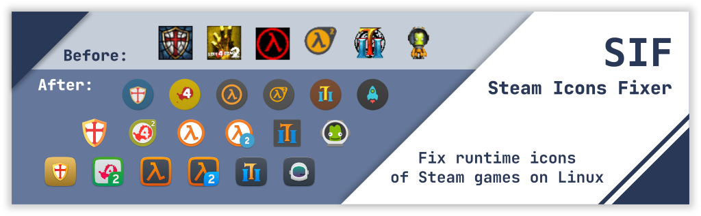

# SIF (Steam Icons Fixer)

**SIF is a simple Python script allowing you to fix runtime
icons of Steam games displayed in dock or panel to match
Linux system icon theme.**

**It aims to be safe, simple and intuitive.**<br>The script must be run by a regular
user and modifies only files in `~/.local/share/applications` directory.

I created this script because I find it very frustrating when the game
icons don't fit the selected icon theme.

The script was tested on [Gnome](https://www.gnome.org/) and [KDE](https://kde.org/)
with [Dash to Dock](https://micheleg.github.io/dash-to-dock/),
[Plank](https://launchpad.net/plank),
[Latte](https://apps.kde.org/latte-dock/) and
[Numix-Circle](https://github.com/numixproject/numix-icon-theme-circle),
[Numix-Square](https://github.com/numixproject/numix-icon-theme-square),
[Papirus](https://github.com/PapirusDevelopmentTeam/papirus-icon-theme)
and [Suru++](https://github.com/gusbemacbe/suru-plus/) icon themes.



# Description

This paragraph explains **how SIF script works**.

1. Finds all Steam library folders and installed games.
2. For each one game checks:
    1. If game has a record in [database.json](https://github.com/BlueManCZ/SIF/blob/master/database.json) or uses Proton compatibility tool.
    2. If particular icon is available in the selected icon theme.
3. Creates hidden .desktop file with correct **Name**, **Icon** and **StartupWMClass** for each game.
4. If required, adds fix to Steam game launch options.

# Installation

Make sure you have installed Python modules **[PyGObject](https://pypi.org/project/PyGObject/)**, **[requests](https://pypi.org/project/requests/)**
and **[vdf](https://pypi.org/project/vdf/)**. You can use your package manager or pip3 to install them.

Example (after you clone the respository): `pip3 install -r requirements.txt --user`

Also make sure you have **[xdotool](https://www.mankier.com/1/xdotool)** installed. It should be available in the official repositories.

After that, all you need to do is **clone** this repository:
```
git clone https://github.com/BlueManCZ/SIF.git
cd SIF
```

Gentoo users may use [ebuild](https://github.com/BlueManCZ/edgets/blob/master/app-misc/sif/sif-9999.ebuild) in the [Edgets overlay](https://github.com/BlueManCZ/edgets/).

Arch users may use [pkgbuild](https://aur.archlinux.org/cgit/aur.git/tree/PKGBUILD?h=sif-git) from the [AUR](https://aur.archlinux.org/packages/sif-git/).

# Usage

See `./sif.py --help` for all options.

### Check

You can **check** which games can be fixed before applying the fix:
```
./sif.py --icons
```
or:
```
./sif.py --pretend
```

### Apply

If commands above worked without a problem, you can **apply** the fix:
```
./sif.py 
```
If you want to **clear** previous fixes before applying new ones:
```
./sif.py --clear
```
You can also fix only one specific game:
```
./sif.py --single APP_ID
```

### Restore
If you want to **remove** all changes and restore default icons:
```
./sif.py --restore
```

# Contribution

For the fix to work, I need to know WM_CLASS of each individual game.
I can create fixes only for games which I have installed and I can get
their WM_CLASS.

If you want append your game to our database, you have to know **APP_ID**
and **WM_CLASS** of this game.

#### Get APP_ID

There are multiple ways, how to get APP_ID of Steam game.

1. You can use `./sif.py --games` to get APP_IDs of all installed games.
2. From the [steamdb.info](https://steamdb.info/).
3. From the [store.steampowered.com](https://store.steampowered.com/) URL address.


#### Get WM_CLASS

Users with xorg can use xprop tool.

1. Start your game from Steam library.
2. Open new terminal window and run `xprop WM_CLASS`.
3. Switch to the game window with Alt-Tab and left click with mouse on it.
4. Switch back to the terminal and get your WM_CLASS.

#### Missing WM_CLASS?

Some games have their WM_CLASS missing. In this case you can use a WM_NAME of the game. `xprop WM_NAME`

#### Proton games are supported natively

Do not contribute Proton games to the database, because they are supported natively.
WM_CLASS of each Proton game is `steam_app_<APP_ID>`. It is calculated automatically.

#### Create issue or append database 

You can open a [new issue](https://github.com/BlueManCZ/SIF/issues), where you provide APP_ID, WM_CLASS (and your icon theme),
and I will add your game to the database as soon as possible.

You can also fork this repository, edit [database.json](https://github.com/BlueManCZ/SIF/blob/master/database.json)
yourself and create a [pull request](https://github.com/BlueManCZ/SIF/pulls). Please keep the file sorted by APP_ID.

Your contribution is welcome.
